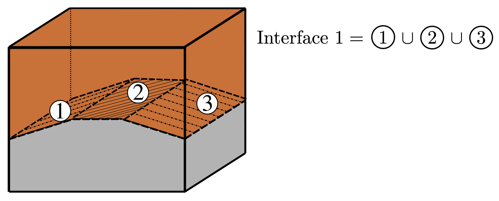
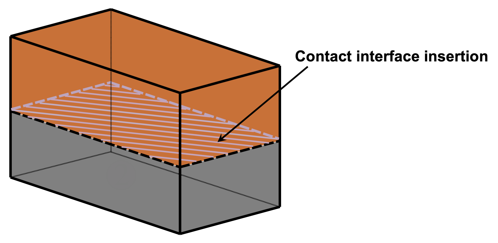
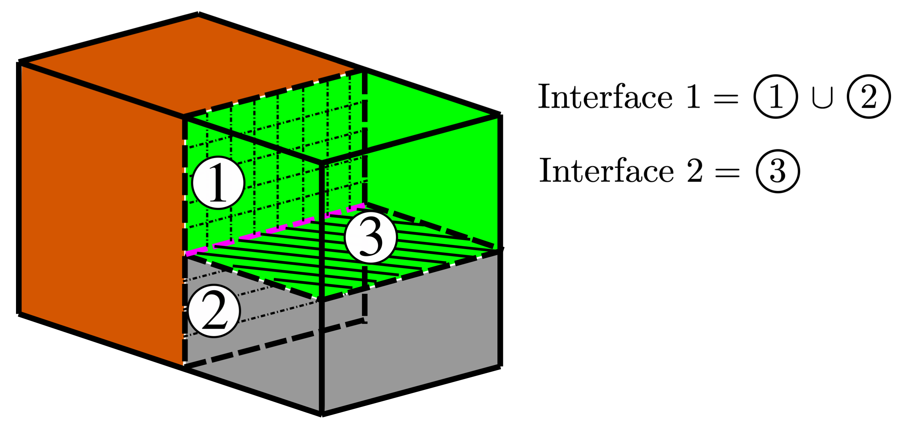
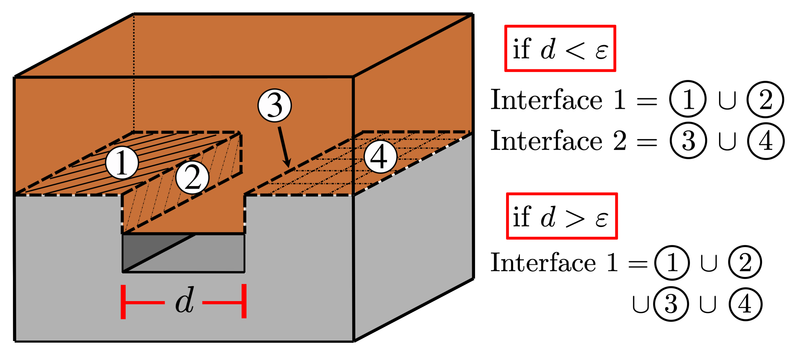

## Brief description 
Contact interaction between elastic solids having matching meshes in the contact interface.

## 1. Definition of the contact interface(s)

Contacting solids should be merged (glued) along the apparent contact 
interface(s) in the input mesh. Each contact interface should be introduced in
the bulk of the mesh as a _BLOCKSET_ with a name starting with `INT_CONTACT`. An
arbitrary number of contact interfaces may be defined, each including an 
arbitrary number of meshed surfaces: 

 *Contact interface definition* 

----

Below we consider several examples of contact interfaces arrangement, outlining which cases are currently supported, and which are not:

1. Contact interface cutting through the whole body: **SUPPORTED**
 *Case 1: Contact interface cutting through the whole body  (**SUPPORTED**)*

----

2. Contact interface cutting through a part of the body: **NOT SUPPORTED**
 *Case 2: Contact interface cutting through a part of the body (**NOT SUPPORTED**)*

----

3. Contact interface cutting through a part of the body and meeting another contact interface cutting through the whole body: **SUPPORTED**
 *Case 3: Contact interface meeting another contact interface (**SUPPORTED**)*

----

4. Contact interface consisting of non-intersecting surfaces: **SUPPORTED**, given that the outlined below conditions are satisfied, with the distance threshold considered as 3 elements in the bulk mesh  
 *Case 4: Contact interface consisting of non-intersecting surfaces (**SUPPORTED**)*

## 2. Creation of the _MED_ mesh file in _Salome_ 

***_NOTE:_*** In order to use the matching meshes contact the solids need to touch each other along the contact surface in the input mesh. Presented below is a rather general approach which permits to mesh the contacting solids separately, refine these meshes around the contact surface, and, finally, merge the meshes together.

### Geometry:

- Create the contacting solids separately 
- Use _Intersection_ to find common geometrical entities
- Create the contact surface using _Build -> Face_ from the intersection 
- _Partition_ solids with the intersection (one by one)
- Create all necessary groups for the partitioned solids:
    - Groups of volumes for solid blocks
    - Groups of faces for fixed BCs
    - Group of faces for pressure BCs
    - Group of faces for springs 
    - Group of faces for the contact interface (same name per contact interface for both solids)

***_NOTE:_*** Springs can be used to eliminate the rigid body motion in a contact simulation  under the pressure control. 

### Mesh:

- Mesh each solid separately
- Create mesh groups from the geometry groups (for each solid separately)
- Mesh the contact surface (sufficiently fine)
- Create a group of faces from the meshed contact surface
- Create a _Submesh_ for each solid coming to contact:
    - _Geometry:_ contact group from the solid's geometry
    - _Algorithm:_ Import 1D-2D Elements from Another Mesh
    - _Hypothesis -> Source Faces:_ group of faces from the meshed contact surface
- Recompute meshes
- Build _Compound mesh_ of solids with node merging on
- Export the Compound mesh to the _MED_ file

## 3. Preparation of the config file
- Change directory to the following:
```bash
cd $HOME/mofem_install/um/build_release/basic_finite_elements/simple_contact/examples/salome
```
- To see all block IDs in the _MED_ file:
```bash
$HOME/mofem_install/um/build_release/tools/read_med -med_file punch_test.med
```

- Check _BLOCKSET_ for the contact interface in the config file `punch_test.cfg`:
```bash
# Contact interface
[block_2]               # Block ID in the MED file 
id=2003                 # Block ID in the output *.h5m file
add=BLOCKSET            # Block type
name=INT_CONTACT        # Block name (starts exactly like this)
```

- Check _BLOCKSETs_ for springs in the config file:
```bash
# Springs on the bottom of the target solid
[block_5]               # Block ID in the MED file 
id=2004                 # Block ID in the output *.h5m file
add=BLOCKSET            # Block type
name=SPRING_BC          # Block name (starts exactly like this)
user1=0		            # Spring stiffness in normal direction 
user2=1e-4		        # Spring stiffness in tangential directions 

# Springs on the top of the impactor solid
[block_6]               # Block ID in the MED file 
id=2005                 # Block ID in the output *.h5m file
add=BLOCKSET            # Block type
name=SPRING_BC          # Block name (starts exactly like this)
user1=0		        # Spring stiffness in normal direction 
user2=1e-4		        # Spring stiffness in tangential directions 
```
***_NOTE:_*** For the considered example the normal stiffness can be set to `0`, while the tangential one can be set to `1e-4`. In general, the stiffness of the springs needs to be chosen as small as possible to avoid effect on the solution, while permitting to eliminate any rigid body motions.

## 4. Generation of the _h5m_ file

- Generate `punch_test.h5m` file:
```bash
$HOME/mofem_install/um/build_release/tools/read_med -med_file punch_test.med \
-meshsets_config punch_test.cfg \
-output_file punch_test.h5m
```

- The correct definition of all blocks can be verified by generating `vtk` files for each one of them for visualisation in _Paraview_:
```bash
$HOME/mofem_install/um/build_release/tools/meshset_to_vtk -my_file punch_test.h5m
```

## 5. Preparation of the param file 

Check the essential contact parameters in the file `param_file.petsc`: 
```bash
-my_order 2         
-my_order_lambda 1          
-my_cn_value 1.e3       
-my_r_value 1.0            
```

### Contact parameters:

Name | Description | Default value
--- | --- | ---
`my_order` | Approximation order of the field of spatial positions for the entire mesh | `1`
`my_order_lambda` | Approximation order of the field of contact Lagrange multipliers | `1`
`my_order_contact` | Approximation order of the field of spatial positions for the contact elements and a given number of tetrahedral element layers adjacent to the contact interface | `1`
`my_ho_levels_num` | Number of tetrahedral element layers adjacent to the contact interface with higher order of the field of spatial positions (if `my_order_contact` is higher than `my_order`) | `1` 
`my_cn_value` | Augmentation parameter which affects the convergence and has minimal effect on the solution. Recommended initial value is the Young's modulus of contacting solids (or harmonic mean in case of different values). The optimal value can be found by repetitively increasing/decreasing the initial value by e.g. a factor of 10 | `1`
`my_r_value` | Contact regularisation parameter which can lie between 1.0 and 1.1. Values greater than 1 can speed-up the convergence, but will also alter the stiffness of the contact interface, therefore it is not recommended to change this parameter | `1`
`my_step_num` | Number of steps used to achieve the specified load value (so-called load control). Note that multi-stepping can be particularly important to obtain a solution for highly nonlinear problems | `1` 
`my_alm_flag` | Defines the choice of the algorithm: `0` (False) - Complementarity function approach, `1` (True) - Augmented Lagrangian method | `0`  
`my_out_integ_pts` | If set to `1` (True) the values of contact Lagrange multipliers are output at gauss points of the contact interface | `0`  


## 6. Running the contact simulation

```bash
mpirun -np 2 $HOME/mofem_install/um/build_release/basic_finite_elements/simple_contact/simple_contact -my_file punch_test.h5m
```

## 7. Postprocessing

First, the output `h5m` files need to be converted to `vtk` format. Note that these files can be converted one by one using the `mbconvert` tool:
```bash
mbconvert out.h5m out.vtk
mbconvert out_contact.h5m out_contact.vtk
mbconvert out_contact_integ_pts.h5m out_contact_integ_pts.vtk
```
or all at once by using the multiprocessing script `convert.py`:
```bash
$HOME/mofem_install/um/build_release/tools/convert.py -np 2 out*
```
The obtained `vtk` files can be viewed in the `Paraview`, in particular:
- File `out.vtk` contains the stress tensor components (tag `SPATIAL_POSITION_PIOLA1_STRESS`), as well as material coordinates (tag `MESH_NODE_POSITIONS`) and current coordinates (tag `SPATIAL_POSITION`), which can be used to compute he displacement field with the *Calculator* filter as `DISPLACEMENT=SPATIAL_POSITION-MESH_NODE_POSITIONS`
- File `out_contact.vtk` contains the nodal interpolation of the Lagrange multipliers equivalent to contact pressure (tag `LAGMULT`)
- File `out_contact_integ_pts.vtk` contains values of Lagrange multipliers (equivalent to the contact pressure) at gauss points of the contact interface. Note that the _Point Gaussian_ representation or alternatively the _Glyph_ filter should be used for their visualisation.

