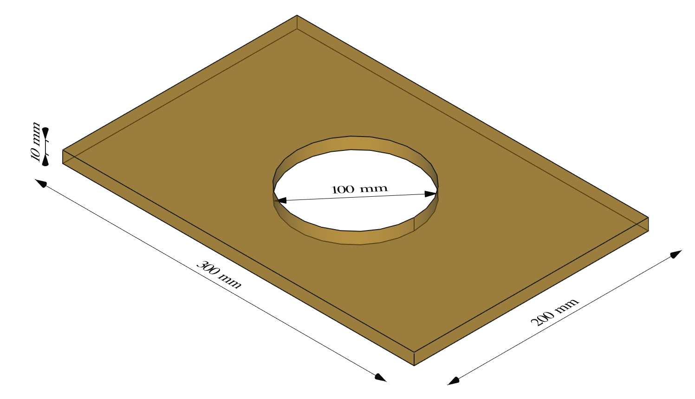

Plate with hole {#jup_plate_with_hole}
===================== 



```python
import sys
sys.path.append("/usr/local/lib/python3.8/site-packages/gmsh-4.8.3-Linux64-sdk/lib")
%load_ext autoreload
%autoreload 2
```

```python
import os
os.system('/usr/bin/Xvfb :%d -screen 0 1024x768x24 &' % os.getuid())
os.environ['DISPLAY'] = ':%d' % os.getuid()
os.environ['PYVISTA_USE_IPYVTK'] = 'true'
print(os.environ['DISPLAY'])
```

```python
import gmsh
import sys
import math
```

```python
gmsh.initialize()
```

```python
gmsh.model.add("HoledPlate2D")
```

```python
# Parameters
L = 150
H = 100
R = 50
```

```python
p1 = gmsh.model.occ.addPoint(0, 0, 0, 0, 1)
p2 = gmsh.model.occ.addPoint(R, 0, 0, 0, 2)
p3 = gmsh.model.occ.addPoint(L, 0, 0, 0, 3)
p4 = gmsh.model.occ.addPoint(L, H, 0, 0, 4)
p5 = gmsh.model.occ.addPoint(0, H, 0, 0, 5)
p6 = gmsh.model.occ.addPoint(0, R, 0, 0, 6)
```

```python
# Creating connection lines
l1 = gmsh.model.occ.addLine(2, 3, 7)
l2 = gmsh.model.occ.addLine(3, 4, 8)
l3 = gmsh.model.occ.addLine(4, 5, 9)
l4 = gmsh.model.occ.addLine(5, 6, 10)
l5 = gmsh.model.occ.addCircleArc(6, 1, 2, 11)
loop1 = gmsh.model.occ.addCurveLoop([l1,l2,l3,l4,l5], 12)
gmsh.model.occ.addPlaneSurface([12], 13)
# This command is mandatory and synchronize CAD with GMSH Model. The less you launch it, the better it is for performance purpose
gmsh.model.occ.synchronize()
```

# BCs

```python
gmsh.model.addPhysicalGroup(2, [13], 400)
gmsh.model.setPhysicalName(2, 400, 'BODY')
gmsh.model.addPhysicalGroup(1, [10], 300)
gmsh.model.setPhysicalName(1, 300, 'FIX_X1')
gmsh.model.addPhysicalGroup(1, [7], 301)
gmsh.model.setPhysicalName(1, 301, 'FIX_Y1')
gmsh.model.addPhysicalGroup(1, [8], 302)
#gmsh.model.setPhysicalName(1, 302, 'FIX_X2')
gmsh.model.setPhysicalName(1, 302, 'FORCE')
```

# Meshing

```python
# Mesh 
mesh_size = 40
gmsh.model.mesh.setSize(
    gmsh.model.getEntitiesInBoundingBox(0, 0, 0, L, H, 0), mesh_size)
gmsh.model.mesh.setSize(
    gmsh.model.getEntitiesInBoundingBox(0, 0, 0, 2*R, H, 0), mesh_size/6)
gmsh.model.mesh.generate(2)
```

```python
# Save mesh
gmsh.write("plate_with_hole.med")
```

```python
# Launch the GUI (not mandatory at all)
#gmsh.fltk.run()
```

```python
# Finalize GMSH = END OF CODE=
gmsh.finalize()
```

```python
#config_file='bc_displacement_control.cfg'
config_file='bc_force_control.cfg'
out_file='plate_with_hole_force_control.h5m'
!read_med -med_file plate_with_hole.med -output_file plate_with_hole_force_control.h5m -meshsets_config {config_file} -log_sl noisy
```

```python
!mbconvert {out_file} plate_with_hole.vtk
```

```python
import pyvista as pv
import matplotlib.pyplot as plt
from matplotlib.colors import ListedColormap

mesh = pv.read('plate_with_hole.vtk')
mesh.plot(show_grid=True, show_edges=True, cpos="xy", smooth_shading=False)  
```

```python

```
